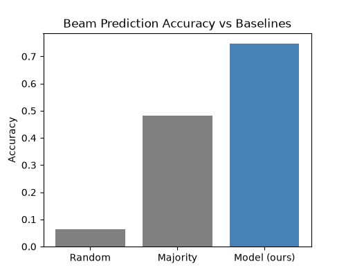
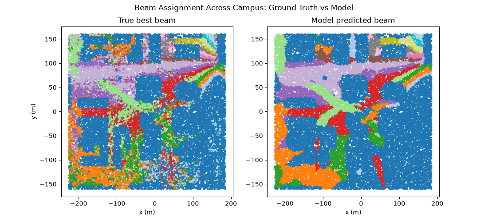
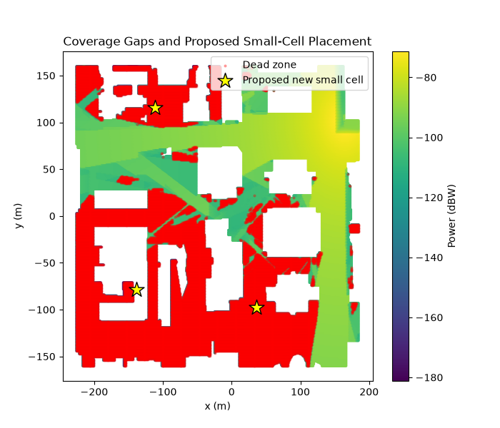
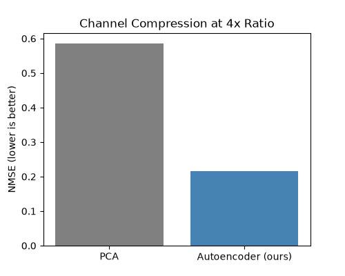

# DeepMIMO ML Portfolio: Four Applied Problems in Realistic 5G/6G Propagation

Four self-contained machine learning projects built on [DeepMIMO](https://www.deepmimo.net/)'s ray-traced dataset of a real university campus — each targeting a genuine problem in wireless network engineering, not a toy benchmark. All four use the same underlying physics-based channel data (`asu_campus_3p5`, 131,931 user locations, 35 buildings, 3.5 GHz).

| Project | Task | Headline Result |
|---|---|---|
| [1. Beam Prediction](#1-beam-prediction) | Predict best antenna beam from user location | 74.8% top-1 / 94.2% top-3 accuracy |
| [2. Coverage Gap Detection](#2-coverage-gap-detection--small-cell-placement) | Find dead zones, propose new tower sites | 30.6% of campus identified as dead zone; 3 sites proposed |
| [3. Channel Compression](#3-channel-compression-csi-feedback) | Compress channel feedback with an autoencoder | 63.1% lower reconstruction error than PCA |
| [4. Blockage Prediction](#4-proactive-blockage-prediction) | Predict LOS/blocked/outage from location | 92.5% accuracy across 3 link-quality classes |

---

## 1. Beam Prediction

**Problem:** mmWave/massive MIMO base stations pick from a codebook of candidate beam directions. Exhaustive beam sweeping (testing every beam) adds latency. Can a model predict the best beam from a user's (x, y) location alone, skipping most of the search?

**Method:** Built a 16-beam steering-vector codebook, computed the true optimal beam per user via exhaustive search over the real ray-traced channel, then trained a 2-layer MLP to predict it from position only.

| Method | Top-1 Accuracy | Top-3 Accuracy |
|---|---|---|
| Random | 6.2% | 18.8% |
| Majority baseline | 48.3% | 48.3% |
| **MLP (ours)** | **74.8%** | **94.2%** |

The model recovers the real spatial beam structure well; predicted regions are somewhat smoother than ground truth near sharp building edges, a limitation of a compact 2-layer network.

---

## 2. Coverage Gap Detection & Small-Cell Placement

**Problem:** Carriers need to find weak-coverage areas and decide where to add new small cells. This is a facility-location problem, not a classification one.

**Method:** Thresholded the strongest-path received power per location at -110 dBW to flag dead zones, then applied K-means clustering (k=3) to the dead-zone locations to propose new small-cell sites.

- **30.6%** of the modeled campus falls below the usability threshold
- K-means proposed 3 candidate sites that visually align with the largest, most isolated dead-zone clusters

**Limitation:** site proposals are based on geometric proximity to dead-zone users, not a re-simulated physics prediction of coverage a new tower would actually produce (that would require re-running ray tracing at each candidate site).

---

## 3. Channel Compression (CSI Feedback)

**Problem:** Devices report their channel state back to the base station ("CSI feedback"), consuming bandwidth. Compressing this efficiently is an active industry research area (Qualcomm, Samsung, etc.).

**Method:** Compared classical PCA against a small nonlinear autoencoder (bottleneck MLP), both compressing an 16-dimensional real/imaginary channel representation down to 4 dimensions (4x compression), measured by normalized reconstruction error (NMSE).

| Method | NMSE (lower is better) |
|---|---|
| PCA | 0.586 |
| **Autoencoder (ours)** | **0.217** |

**63.1% lower reconstruction error than PCA at the same compression ratio** — the nonlinear model captures structure in the channel that linear PCA can't.

---

## 4. Proactive Blockage Prediction

**Problem:** mmWave links can drop instantly when a user walks behind a building. If a network could predict an imminent blockage from location, it could pre-emptively switch beams or cells before service actually fails — a real, active area of 5G/6G research.

**Method:** Trained a 3-class MLP classifier (Outage / NLOS / clear LOS) using only (x, y) location, evaluated against the dataset's ground-truth link status.

- **Link status in this environment:** 19.7% LOS, 44.8% NLOS, 35.5% outage — a genuinely challenging, heavily-obstructed scenario
- **92.5% overall accuracy** across all three classes
- **98% recall on clear-LOS locations** — the model rarely misses a good link when one exists
